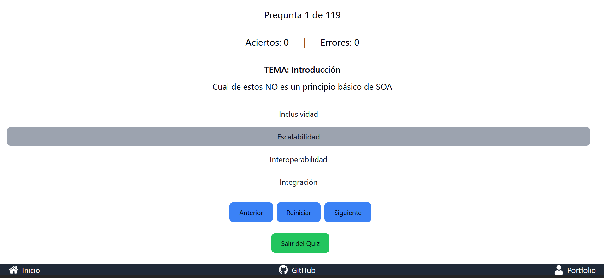

# Aplicación de Test de Conocimientos

Esta aplicación es un test interactivo para evaluar los conocimientos de una asignatura. Está desarrollada con React y TypeScript, y utiliza Vite como herramienta de construcción. La aplicación presenta una serie de preguntas con múltiples opciones de respuesta y permite al usuario navegar entre las preguntas, responderlas y ver si su respuesta es correcta o incorrecta.


## Características
En esta **nueva version**, la aplicación permite al usuario subir su propio archivo JSON con preguntas y respuestas, lo que la hace más flexible y personalizable. Dichos archivos JSON deben seguir un formato específico para que la aplicación pueda interpretarlos correctamente, si no, la aplicación no funcionará. El formato del archivo JSON es el siguiente:

```json
{
  "preguntas": [
    {
            "enunciado": "Cual de estos NO es un principio básico de SOA",
            "opciones": [
                {
                    "texto": "Inclusividad", "correcta": true
                },
                {
                    "texto": "Escalabilidad", "correcta": false
                },
                {
                    "texto": "Interoperabilidad", "correcta": false
                },
                {
                    "texto": "Integración", "correcta": false
                }
            ],
            "tema": "Introducción"
        },
        {
            "enunciado": "¿Qué es SOA?",
            "opciones": [
                {
                    "texto": "Un modelo de desarrollo ágil.", "correcta": false
                },
                {
                    "texto": "Un sistema operativo avanzado.", "correcta": false
                },
                {
                    "texto": "Un estilo de arquitectura para soluciones basadas en servicios.", "correcta": true
                },
                {
                    "texto": "Una metodología para bases de datos relacionales.", "correcta": false
                }
            ],
            "tema": "Introducción"
        }
  ]
}
```

## Requisitos

1. Un navegador web moderno (Chrome, Firefox, Safari, etc.)
2. Node.js y npm instalados en tu máquina. Puedes descargar Node.js desde [aquí](https://nodejs.org/).
3. Python 3 instalado en tu máquina. Puedes descargar Python desde [aquí](https://www.python.org/downloads/). Pero es **opcional**, solo es necesario para generar el archivo json con las preguntas.
4. Un archivo JSON con las preguntas y respuestas.

## Instalación y Ejecución

1. Clona el repositorio.
2. Navega al directorio del proyecto.
3. Instala las dependencias con `npm install`.
4. Inicia la aplicación en modo desarrollo con `npm run dev`.
5. Abre tu navegador y ve a `http://localhost:5173` para ver la aplicación en funcionamiento.

## Scripts Disponibles

- `npm run dev`: Iniciar la aplicación en modo desarrollo.
- `npm run build`: Construir la aplicación para producción.

## Script de python
Para facilitar(me) el trabajo de generar el archivo json con las preguntas, creé un script en python que se encarga de leer un archivo txt con las preguntas y respuestas y generar el archivo json correspondiente. Este script se encuentra en la carpeta `scripts` y se llama `generate_questions.py`.
Este archivo se encarga de leer un archivo txt con las preguntas del tema a evaluar y generar un archivo json con las mismas. Para ejecutarlo, debes ejecutar el siguiente comando en la terminal:

```bash
python3 scripts/generate_questions.py
```

Asegurense de tener instalado python3 en su computadora.
Tambien de tener un archivo 'preguntas.txt' con las preguntas y respuestas. El formato de las preguntas y respuestas debe ser el siguiente:

```markdown
Tema 1: Introducción
1. Unas de estas opciones NO es un tipo de Sistema Operativo
a) Distribuido
b) En red
c) Monolítico*
d) Por lotes

...

Tema 2: Windows Server
1. ¿Qué servicio de Windows Server se utiliza para la gestión de usuarios y equipos a través de directivas?
a) IIS
b) SQL Server
c) Active Directory *
d) Azure

..etc
```
**CONSEJO:** Si tienes un archivo con preguntas y respuestas en otro formato, te recomiendo usar un modelo de lenguaje natural para convertirlo a este formato. Puedes usar herramientas como ChatGPT o cualquier otro modelo de lenguaje para ayudarte con esto. Es probable que el modelo de lenguaje no pueda identificar correctamente todas las preguntas y respuestas, pero puedes corregirlo fácilmente después de que el modelo genere el archivo. **Recuerda que el formato del archivo json es muy importante para que la aplicación funcione correctamente.**
**Ten en cuenta que el script de python no es perfecto y puede no identificar correctamente todas las preguntas y respuestas.**

**NOTA: El script está programado para que, en caso de no poder identificar correctamente, se rellene el enunciado o la opcion con la frase "texto faltante". Verifica el json generado para ver si se ha generado correctamente**

## Pendientes
- [ ] Mejorar la interfaz de usuario para que sea más atractiva y fácil de usar.
- [ ] Agregar ventanas con mensajes explicativos sobre la subida de archivos JSON.

## Contribuciones

Las contribuciones son bienvenidas. Por favor, abre un issue o un pull request para discutir cualquier cambio que te gustaría realizar.

## Licencia

Este proyecto está licenciado bajo la Licencia MIT. Consulta el archivo [LICENSE](./LICENSE) para más detalle.